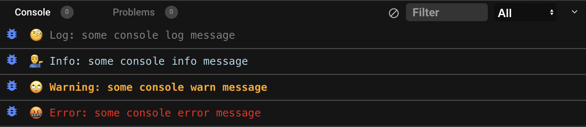

<p align="center"><a href="https://github.com/dillonbaird/consoleswag#nastyox"></a></p>
<h1 align="center">consoleSwag.js</h1>
<p align="center">Console messages, with swag.</p>

<p align="center">
  <a href="https://www.npmjs.com/package/consoleswag"></a>
  <a href="https://www.npmjs.com/package/consoleswag"></a>
  <a href="https://www.jsdelivr.com/package/npm/consoleswag"></a>
  <a href="https://www.npmjs.com/package/consoleswag"></a>
  <a href="https://www.npmjs.com/package/consoleswag"></a>
</p><br/><br/>

<p align="center"></p><br/>

## 🙉 What's this all about?

Tired of those boring and basic console messages? Ever wanted to express your creativity through your console? Just want to add some hidden easter-eggs into your project? Well, then this is the library for you!<br/>

<a href="https://github.com/dillonbaird/consoleswag" target="_blank">consoleSwag.js</a> helps Javascript developers make console message more fun; making them stand out and pop with style. Whether you want to display an image banner, or just prepend existing console messages with emojis, we've got you covered. The best part? Our library is extremely lightweight and developer friendly- which means it won't take a toll on your project, and it's uber-simple to implement.<br/>

<i>This shouldn't need to be said, but just in case: <b>Please DO NOT use this in any enterprise production software!</b> This was made purely for fun, and to maybe make your debugging sessions a little less mundane. You have been warned. </i>
<br/><br/>

## ⚡️ Fast implementation

**Step 1:** Paste the following script tag into the head of your HTML document:<br/>

```JavaScript
<script src="https://cdn.jsdelivr.net/npm/consoleswag/lib/index.js"></script>
```

Or, use npm:

```JavaScript
//Install:
npm i consoleswag

//Then, paste this at the top of your JavaScript file:
const cswag = require("consoleswag");

//Note: If your project is a module, you can paste this in your JavaScript file instead:
import cswag from 'consoleswag';
```

**Step 2:** Use any of the commands explained at below however you like. <br/><br/><br/>

## 🎉 Examples

### ⌶ Basic (Big Text)

```js
cswag.basic("So much swag!"); //=> Basic default styling
```

<br/>

### 🌆 Image Banner

```js
cswag.imgBanner("https://picsum.photos/200/600", "So Much Swag!");  //=> Image Banner
```

<br/>

### 🎨 Style All Console Messages

```js
const cswagOptions = {
  bgColor: "blue",
  padding: "20px",
  lineHeight: "100px",
  fontSize: "30px",
  fontFamily: "arial",
};
cswag.styleAll(cswagOptions);

console.log("some console log message");
//=> All console.log messages styled with options
```

<br/>

### 🤪 Emojify

```js
cswag.emojify();                              //=> All console messages styled with emojis

console.log("some console log message");      //=>  🧐 Log Message: some console log message
console.info("some console info message");    //=>  💁‍♂️ Info: some console info message
console.warn("some console warn message");    //=>  🙄 Warning: some console warn message
console.error("some console error message");  //=>  🤬 Error: some console error message
```

<br/>

<br/><br/><br/>

## 👏 Supporters

[](https://github.com/dillonbaird/consoleswag/stargazers)
[](https://github.com/dillonbaird/consoleswag/network/members)

<p align="center"></p>
<br/>
<p align="center"><a href="https://github.com/dillonbaird/consoleswag#"></a></p>
